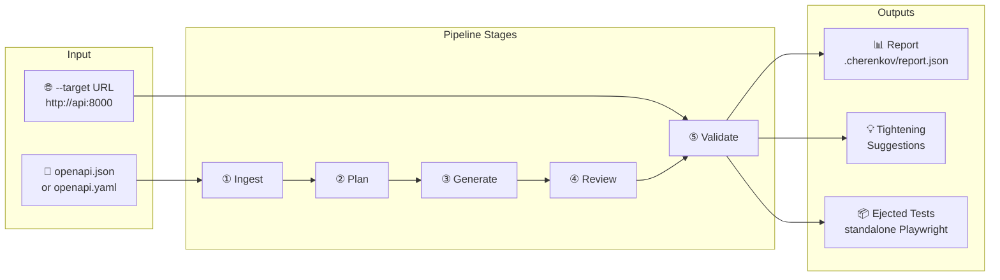
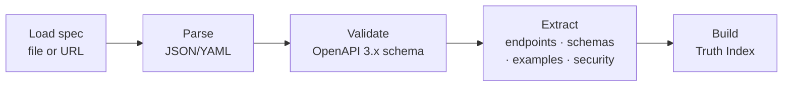
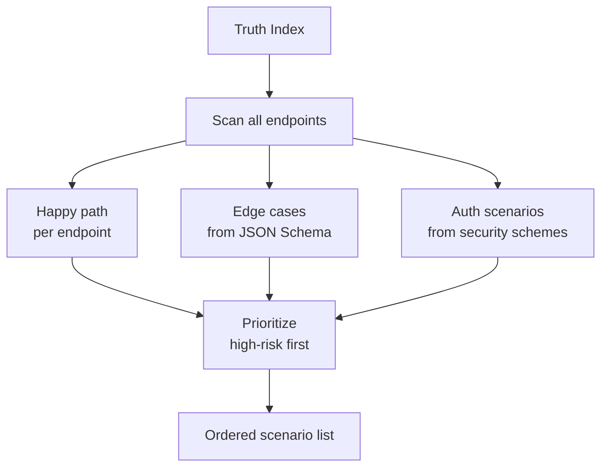
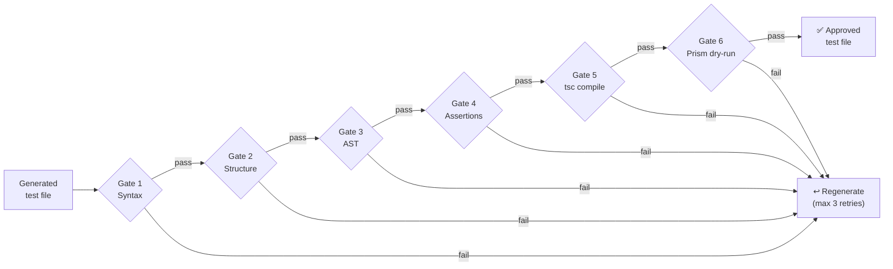
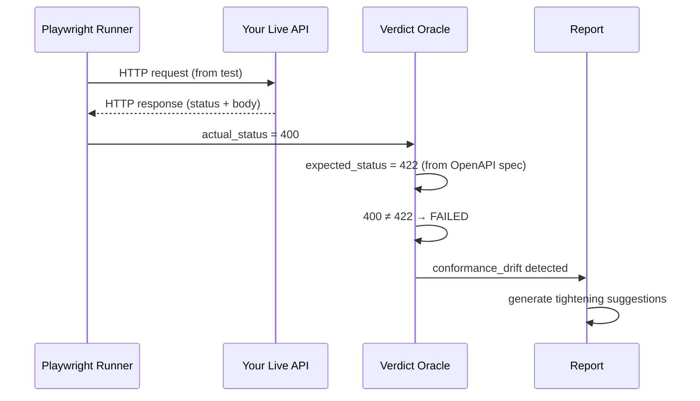

# Pipeline

> **Navigation:** [Home](Home.md) · **Pipeline** · [Architecture](Architecture.md) · [CLI Reference](CLI-Reference.md) · [Configuration](Configuration.md) · [Deployment](Deployment.md) · [Roadmap](Roadmap.md) · [FAQ](FAQ.md) · [Troubleshooting](Troubleshooting.md)

This page walks through every stage of the CHERENKOV pipeline — from spec ingestion to conformance report — with enough detail to understand what's happening and why.

---

## The Full Picture



---

## Stage 1 — Ingest

**Code:** `cherenkov/stages/ingest.py`

The pipeline starts by loading and validating your OpenAPI spec. CHERENKOV supports both JSON and YAML formats, local files and remote URLs.

```bash
# You provide either a file...
./bin/cherenkov validate --spec ./openapi.yaml --target http://localhost:8000

# ...or the target URL (CHERENKOV fetches /openapi.json automatically)
./bin/cherenkov validate --target http://localhost:8000
```

**What happens:**



**Output of this stage:** a structured `TruthModel` with all endpoints, their request/response schemas, expected status codes, auth requirements, and example values.

**Fails fast if:** the spec is invalid JSON/YAML, the spec version is not OpenAPI 3.x, or a required field is missing.

---

## Stage 2 — Plan

**Code:** `cherenkov/stages/plan.py`

The planner takes the Truth Index and generates a list of test scenarios — one per meaningful test case.

**Scenario types generated:**

| Type | Description | Example |
|------|-------------|---------|
| **Happy path** | Valid request, expected success response | `GET /pets` → 200 |
| **Required field missing** | Omit a required body field | `POST /users` without `email` → 422 |
| **Type mismatch** | Wrong type for a field | `POST /users` with `age: "abc"` → 422 |
| **Auth missing** | Call a secured endpoint with no token | `GET /profile` without `Authorization` → 401 |
| **Auth expired** | Call with an expired token | `GET /profile` with stale JWT → 401 |
| **Not found** | Request a resource that doesn't exist | `GET /pets/99999` → 404 |
| **Boundary values** | Min/max constraints from spec | `POST /users` with `password` of length 7 (min is 8) → 422 |



**Output:** an ordered list of `TestScenario` objects — each has an endpoint, HTTP method, request payload, expected status code (from spec), and a human-readable description.

---

## Stage 3 — Generate

**Code:** `cherenkov/stages/generate.py`

For each scenario, the generator builds a prompt and asks the local LLM to write a Playwright test.

**Prompt structure:**

```
System: You are a TypeScript test engineer. Write Playwright API tests using openapi-fetch.
        Never hardcode expected status codes — read them from the test scenario context.

User:   Endpoint: POST /users
        Request schema: { email: string, password: string (min 8) }
        Scenario: password_too_short — password.length < 8
        Expected status: 422 (from OpenAPI spec: POST /users → responses.422)
        
        Write a Playwright test for this scenario.
```

**What the LLM generates:**

```typescript
import { test, expect } from '@playwright/test';
import createClient from 'openapi-fetch';
import type { paths } from '../generated-types';

const client = createClient<paths>({ baseURL: process.env.TARGET_URL });

test('password_too_short — POST /users returns 422 for short password', async () => {
  const { response } = await client.POST('/users', {
    body: { email: 'test@example.com', password: 'short' }
  });
  expect(response.status).toBe(422);
});
```

**Key point:** the expected status (`422`) comes from the OpenAPI spec, not from the LLM's knowledge. The LLM writes the test structure; the spec provides the oracle.

**LLM used:** `qwen2.5-coder:7b` via Ollama (default). Swap via `CHERENKOV_LLM_MODEL` env var. See [Configuration](Configuration.md).

---

## Stage 4 — 6-Gate Review

**Code:** `cherenkov/stages/review.py`

Every generated test passes through six review gates before it's allowed to run. Any gate failure causes the test to be regenerated (up to 3 retries).



| Gate | What It Checks | Tool Used |
|------|----------------|-----------|
| **Syntax** | File is parseable TypeScript | Custom parser |
| **Structure** | Has exactly one `test()` call, correct imports | AST check |
| **AST** | No forbidden patterns (eval, hardcoded IPs, etc.) | AST visitor |
| **Assertions** | At least one `expect()` call; status assertion present | AST visitor |
| **TypeScript** | Compiles without errors | `tsc --noEmit` |
| **Prism dry-run** | Runs against Prism mock server (not live server) | Playwright + Prism |

Gate 6 (Prism) is the most valuable: it catches tests that are syntactically correct but semantically wrong (wrong endpoint path, wrong body shape) without hitting your real server.

---

## Stage 5 — Validate

**Code:** `cherenkov/execution/validate.py`

The approved test files run against your live server. Playwright executes each test in a fresh browser context and CHERENKOV compares the actual response against the spec-derived expected status.



**Output:** a JSON report at `.cherenkov/report.json` with:

```json
{
  "run_id": "2026-06-09T14:23:01Z",
  "target": "http://localhost:8000",
  "results": [
    {
      "test": "happy_path",
      "endpoint": "GET /pets",
      "status": "PASSED",
      "actual_status": 200,
      "expected_status": 200,
      "duration_ms": 195
    },
    {
      "test": "password_too_short",
      "endpoint": "POST /users",
      "status": "FAILED",
      "actual_status": 400,
      "expected_status": 422,
      "drift": "status_mismatch",
      "duration_ms": 211
    }
  ],
  "tightening_suggestions": [
    {
      "test": "happy_path",
      "suggestions": [
        "assert response.headers['content-type'] includes 'application/json'",
        "assert typeof response.body.id === 'number'"
      ]
    }
  ]
}
```

---

## Eject — Taking Your Tests Elsewhere

After validation, you can eject the generated tests as standalone Playwright:

```bash
./bin/cherenkov eject --output ./my_tests
cd my_tests && npm install && npx playwright test
```

The ejected files have:
- Zero CHERENKOV imports
- All `openapi-fetch` bindings intact
- The same assertions as the reviewed+validated versions
- A self-contained `package.json` and `playwright.config.ts`

**The eject invariant is tested in CI**: `tests/smoke/smoke_test_eject.py` verifies that `npx playwright test` passes on ejected output without CHERENKOV on the PATH.

---

## Healing — When Tests Fail

Healing never modifies your tests. It only suggests.

```bash
./bin/cherenkov heal --report .cherenkov/report.json
```

The healer reads the report, classifies each failure, and writes a human-readable suggestion file:

```
failure: password_too_short
  type: status_mismatch (expected 422, got 400)
  likely cause: server uses 400 for validation errors instead of 422
  suggestion:
    Option A — Fix the server: return 422 for validation errors (RFC 9110 §15.5.22)
    Option B — Update the spec: change responses.422 to responses.400 for POST /users
```

See [Architecture — Healing Architecture](Architecture.md#healing-architecture) for the full healing flow.

---

## Continuous Watch Mode

The `daemon` command watches your spec file and re-runs the pipeline on every change:

```bash
./bin/cherenkov daemon --spec ./openapi.yaml --target http://localhost:8000
```

This is useful during active API development: change your spec, see conformance results immediately.

---

## Timeouts and Performance

Typical pipeline times on an RTX 5060 8GB (warm Ollama):

| Stage | Typical Time |
|-------|-------------|
| Ingest | < 1s |
| Plan (10 scenarios) | < 1s |
| Generate (1 test) | 3–5s |
| Review (1 test, all 6 gates) | 2–4s |
| Validate (10 tests, live server) | 5–20s |
| **Full run (10 scenarios)** | **~60–120s** |

CPU fallback (no GPU): ~10× slower (~15–20s per generated test).

---

## Further Reading

- [CLI Reference](CLI-Reference.md) — `validate`, `eject`, `heal`, `daemon` flags
- [Architecture](Architecture.md) — system design and component relationships
- [Configuration](Configuration.md) — LLM settings, timeouts, model selection
