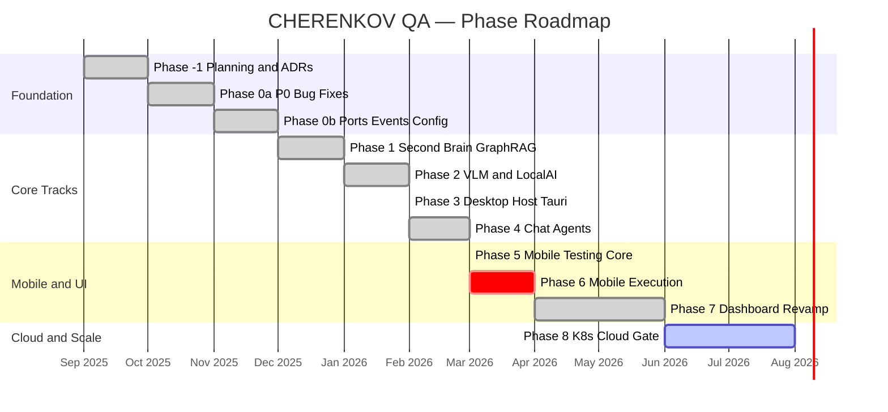

# Roadmap

> **Navigation:** [Home](Home.md) · [Pipeline](Pipeline.md) · [Architecture](Architecture.md) · [CLI Reference](CLI-Reference.md) · [Configuration](Configuration.md) · [Deployment](Deployment.md) · **Roadmap** · [FAQ](FAQ.md) · [Troubleshooting](Troubleshooting.md)

Where CHERENKOV came from, where it is now, and where it's going.

> **Canonical status (single source of truth):** [docs/STATUS.md](../STATUS.md)  
> **Full detailed plan:** [docs/PHASE_PLAN.md](../PHASE_PLAN.md)

---

## Phase Timeline

---

## Current Status

| Phase | Name | Status | Notes |
|------:|------|:------:|-------|
| **-1** | Planning & Preparation | ✅ Done | 6 ADRs, strategy docs |
| **0a** | P0 Bug Fixes | ✅ Done | 8 bugs resolved (issues #304–#312) |
| **0b** | Foundations | ✅ Done | Ports/Adapters, events, config, device layer |
| **1** | Second Brain | ✅ Done | Knowledge mesh, GraphRAG, event bridges |
| **2** | VLM + LocalAI | ✅ Done | LocalAI default, tier routing, doctor CLI |
| **3** | Desktop Host | ⏸ Blocked | Built + tested; blocked on `cargo` (Rust toolchain) |
| **4** | Chat Agents | ✅ Done | Tool-calling, persona registry, SSE streaming |
| **5** | Mobile Testing Core | ⏸ Blocked | Built + tested; blocked on ADB |
| **6** | Mobile Execution | ⏸ Blocked | Depends on Phase 5 |
| **7** | Dashboard Revamp | ✅ Done | All 9 screens shipped |
| **8** | K8s + Cloud + Gate | 🔶 Active | CRD + controller coded; `k3d-test` validation pending |

**Legend:** ✅ Done · 🔶 Active · ⏸ Blocked

---

## Track Status

| Track | Scope | Built | Runtime |
|-------|-------|:-----:|:-------:|
| **A** Core engine | API conformance testing | ✅ | ✅ Validation gate passed 2026-06-08 |
| **B** VLM substrate | Ollama + LocalAI routing | ✅ | ✅ |
| **C** Desktop | Tauri 2 app | ✅ | ⏸ needs `cargo` |
| **D** Mobile | Maestro + Appium | ✅ | ⏸ needs ADB |
| **E** Dashboard | React UI (9 screens) | ✅ | ✅ |
| **F** K8s | Operator + CRDs | 🔶 | 🔶 Phase 8 in progress |

---

## Phase Summaries

### ✅ Phase -1 — Planning

6 Architecture Decision Records written before any code:

| ADR | Decision |
|-----|----------|
| ADR-001 | Seam widening: extend at seams, never fork cores |
| ADR-002 | Tauri 2 for desktop (vs Electron) |
| ADR-003 | LocalAI as default VLM backend |
| ADR-004 | Clean Architecture — Ports/Adapters pattern |
| ADR-005 | Event-driven orchestration |
| ADR-006 | Knowledge mesh: graph + vector, not vector-only |

### ✅ Phase 0 — Foundations

Clean architecture skeleton, P0 bugs, device abstraction layer.

### ✅ Phase 1 — Second Brain

Knowledge mesh that lets CHERENKOV learn from your codebase over time.
GraphRAG for retrieval, idiom extractor for pattern learning, schema index for fast lookup.

### ✅ Phase 2 — VLM + LocalAI

Vision model support. LocalAI as the default GPU-tier backend.
GPU tier routing, `cherenkov doctor` environment checker.

### ✅ Phase 4 — Chat Agents

Natural language interface. Tool-calling agent with persona registry, SSE streaming.
Ask CHERENKOV questions about your spec and test results in plain English.

### ✅ Phase 7 — Dashboard

All 9 screens in React 19 + Vite + TypeScript + Tailwind CSS 4:
Run History · Test Explorer · Spec Viewer · Healing Queue · Knowledge Graph · Mobile · Chat · Settings · Governance

### 🔶 Phase 8 — K8s + Cloud (Active)

Current work: making CHERENKOV cloud-native.

**Done:**
- `ConformanceCheck` CRD definition and Go controller
- Device environment variables for K8s jobs
- `SECURITY.md` security policy (issue #404)
- k8s-run CLI bridge

**In Progress:**
- `make k3d-test` validation
- Open-source readiness checklist

**Blocked:**
- Phase 3 (Desktop): needs `cargo` — `curl --proto '=https' --tlsv1.2 -sSf https://sh.rustup.rs | sh`
- Phases 5–6 (Mobile): needs ADB — install Android platform tools

---

## What's Not Planned (Intentionally)

| Non-Goal | Why |
|----------|-----|
| Managed cloud hosting | Self-hosted is the promise; cloud is L4+ opt-in |
| Auto-fixing production code | D7 invariant: suggest-only, never auto-edit |
| Replacing your existing tests | Complements existing suites, doesn't replace them |
| Vendor model lock-in | Always model-agnostic via capability tiers |

---

## Contributing to the Roadmap

- **Suggest a feature:** Open an issue with `type:feature` label
- **Work on an item:** Pick an issue with `status:ready` + `agent-ready` labels
- **Full ticket breakdown:** [docs/PHASE_PLAN.md](../PHASE_PLAN.md) (~105 issues)
- **Workflow:** [Way-of-Work.md](Way-of-Work.md)
