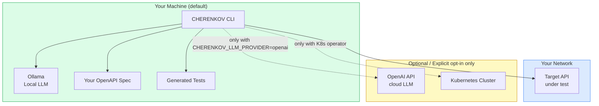

# Security

> **Navigation:** [Home](Home.md) · [Architecture](Architecture.md) · [Contributing](Contributing.md) · **Security**

Security policies, vulnerability reporting, and secure usage guidelines.

> **Formal security policy:** [SECURITY.md](../../SECURITY.md)

---

## Reporting a Vulnerability

**Do not open a public GitHub issue for security vulnerabilities.**

Report privately instead:

1. Go to [GitHub Security Advisories](https://github.com/moaidmoatasem/cherenkov-qa/security/advisories/new)
2. Fill out the form — include steps to reproduce, impact, and affected versions
3. You'll receive a response within 72 hours

We follow responsible disclosure: we'll work with you to fix the issue before any public announcement.

---

## Security Model



**What stays local by default:**
- Your OpenAPI spec
- Generated test files
- Test results and reports
- LLM prompts and responses (Ollama is local)

**What leaves your machine only with explicit configuration:**
- Your spec (if `CHERENKOV_LLM_PROVIDER=openai` is set)
- Test run data (if Logfire token configured)

---

## Security Invariants

| Invariant | How It's Enforced |
|-----------|------------------|
| **No egress by default** | Ollama runs locally; no cloud API calls without explicit config |
| **No auto-edit** | D7 — CHERENKOV never modifies your test files automatically |
| **Suggest-only healing** | Healing produces markdown files; never executes changes |
| **Dependency scanning** | Snyk + CodeQL run on every PR (CI job: `security-scan.yml`) |
| **Secrets not logged** | Auth tokens in env vars are redacted from all output |

---

## Supported Versions

| Version | Security Support |
|---------|:----------------:|
| `main` branch | ✅ Active |
| `foundation-v0` | ⚠️ Critical fixes only |
| Older tags | ❌ No support |

---

## Known Security Considerations

### LLM-Generated Code

CHERENKOV uses an LLM to generate Playwright test code. Before running generated tests:

- The 6-gate review pipeline filters for unsafe patterns (no `eval`, no hardcoded credentials, no network calls outside the target)
- Generated tests run in a sandboxed Playwright context
- Tests run in `--only` mode against the target URL — they cannot reach other systems

**Recommendation:** Review generated tests before running in sensitive environments. Use `--dry-run` to preview without executing.

### API Key Handling

When testing authenticated APIs, pass credentials via environment variables:

```bash
# Safe — not in command history
export CHERENKOV_AUTH_TOKEN=your-token
./bin/cherenkov validate --target http://localhost:8000

# Avoid — visible in process list and shell history
./bin/cherenkov validate --target http://localhost:8000 --token your-token
```

Never put credentials in config files committed to source control.

### OpenAI Provider

If you configure `CHERENKOV_LLM_PROVIDER=openai`:

- Your OpenAPI spec is sent to OpenAI's servers
- OpenAI's data retention policy applies
- Consider removing sensitive endpoint descriptions from the spec before generation

### K8s Operator

The `ConformanceCheck` CRD requires cluster-level permissions. Review the RBAC config in `operator/config/rbac/` before deploying. The operator only needs `get`/`list`/`watch` on `ConformanceCheck` resources and `create`/`list`/`watch` on `Jobs`.

---

## Dependency Security

Dependencies are scanned automatically:

| Tool | Scope | Frequency |
|------|-------|-----------|
| **Snyk** | Python + Node dependencies | Every PR |
| **CodeQL** | Source code analysis | Every PR + weekly |
| **Semgrep** | Security patterns | Every PR (informational) |

Reports are uploaded to GitHub Security tab.

To run Snyk locally:

```bash
# Python
pip install snyk
snyk test

# Node (from stub/)
cd stub && npx snyk test
```

---

## Security Checklist for Contributors

Before opening a PR that touches security-sensitive code:

- [ ] No secrets, API keys, or tokens in code or config files
- [ ] Auth tokens are read from environment variables only
- [ ] External network calls have an explicit `egress` policy
- [ ] LLM prompts don't include user-provided data without sanitization
- [ ] CodeQL and Snyk checks pass
- [ ] No `eval()`, `exec()`, or dynamic code execution in generated tests
- [ ] File paths are validated before use (no path traversal)

---

## Disclosure Policy

We follow [coordinated vulnerability disclosure](https://en.wikipedia.org/wiki/Coordinated_vulnerability_disclosure):

1. You report privately → we respond within 72 hours
2. We investigate and develop a fix (typically within 14 days)
3. We release the fix and credit you in the advisory (unless you prefer anonymity)
4. We publish the advisory after the fix is released

We do not offer a bug bounty program at this time.
