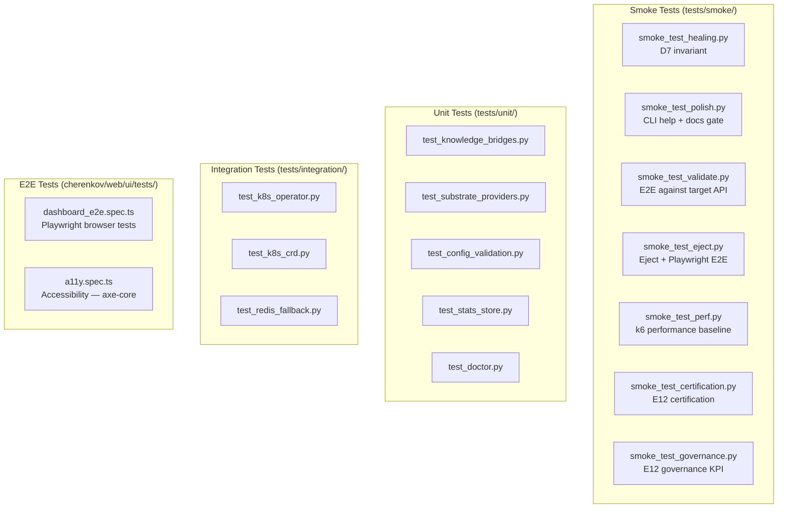

# Testing

> **Navigation:** [Home](Home.md) · [Pipeline](Pipeline.md) · [Architecture](Architecture.md) · [Contributing](Contributing.md) · **Testing** · [Way of Work](Way-of-Work.md)

How to run, write, and interpret tests for CHERENKOV.

---

## Test Suite Overview



---

## Running Tests

### Quick check (unit tests only)

```bash
PYTHONPATH=. python -m pytest tests/unit/ -v
```

### Required smoke tests (what CI runs)

```bash
# D7 invariant — healing never writes test files
PYTHONPATH=. python3 tests/smoke/smoke_test_healing.py

# CLI help + docs gate
PYTHONPATH=. python3 tests/smoke/smoke_test_polish.py

# Documentation coverage check
PYTHONPATH=. python3 scripts/ci_docs_check.py
```

### Full test suite

```bash
PYTHONPATH=. python -m pytest tests/ -v --ignore=tests/integration
```

### With coverage report

```bash
PYTHONPATH=. python -m pytest tests/unit/ tests/smoke/ \
  --cov=cherenkov \
  --cov-report=html \
  --cov-report=term-missing
open htmlcov/index.html
```

### E2E smoke (requires running target API + Playwright installed)

```bash
# Start the target API first
cd target && source ../.venv/bin/activate
uvicorn target_api:app --host 127.0.0.1 --port 8000 &
cd ..

# Run the validate smoke test
PYTHONPATH=. python3 tests/smoke/smoke_test_validate.py

# Run the eject E2E (requires Node + Playwright)
cd stub && npm install && npx playwright install && cd ..
PYTHONPATH=. python3 tests/smoke/smoke_test_eject.py
```

### React dashboard tests

```bash
cd cherenkov/web/ui
npm install
npx playwright install
npx playwright test              # all E2E tests
npx playwright test a11y.spec.ts # accessibility only
```

### Integration tests (requires k3d + Redis)

```bash
# Start services
make k3d-up
docker compose up -d redis

# Run integration tests
PYTHONPATH=. python -m pytest tests/integration/ -v
```

---

## Test Categories Explained

### Smoke Tests

The most important category. Smoke tests assert **design invariants** — things that must *always* be true, regardless of any other change.

| Test | Invariant | What it asserts |
|------|-----------|-----------------|
| `smoke_test_healing.py` | D7 — no auto-edit | Healing only produces suggestion files; never modifies test files |
| `smoke_test_eject.py` | Anti-lock-in | Ejected tests run with `npx playwright test` and zero CHERENKOV imports |
| `smoke_test_validate.py` | Spec-derived oracle | Expected status from spec; catches real 422 vs 400 bug |
| `smoke_test_polish.py` | CLI help + docs parity | Every flag in `--help` has a matching doc entry |

These run in CI as **required checks** on every push to `main`.

### Unit Tests

Test individual modules in isolation — no network calls, no file system (except temp files), no external services.

```python
# Good unit test pattern
def test_substrate_router_selects_ollama_for_code_gen():
    router = SubstrateRouter(providers={"ollama": mock_ollama})
    request = ReasoningRequest(capability_tier="code-gen")
    provider = router.select(request)
    assert provider.name == "ollama"
```

### Integration Tests

Test against real services. Require `k3d`, `redis`, or other infrastructure. Gated in CI — only run when infrastructure is available.

---

## Writing New Tests

### Where to put your test

| You're testing... | Put it in... |
|-------------------|-------------|
| A pure function or class | `tests/unit/test_<module>.py` |
| A design invariant | `tests/smoke/smoke_test_<feature>.py` |
| K8s operator behavior | `tests/integration/test_k8s_*.py` |
| React UI | `cherenkov/web/ui/tests/*.spec.ts` |
| A whole CLI command | `tests/smoke/smoke_test_<command>.py` |

### Naming convention

```python
# File: tests/unit/test_substrate_router.py
# Class: TestSubstrateRouter (optional)
# Method: test_<what>_<when>_<expected_outcome>

def test_router_falls_back_to_openai_when_ollama_unavailable():
    ...
```

### Smoke test template

```python
#!/usr/bin/env python3
"""
Smoke test: <invariant name>

Asserts: <what must always be true>
"""

import sys
import os

REPO_ROOT = os.path.dirname(os.path.dirname(os.path.dirname(__file__)))
sys.path.insert(0, REPO_ROOT)

def test_<invariant_name>():
    # Arrange
    ...
    
    # Act
    result = run_the_thing()
    
    # Assert the invariant explicitly
    assert invariant_holds(result), (
        "INVARIANT VIOLATED: <explain what went wrong>\n"
        f"Got: {result}\n"
        "Expected: <what was expected>"
    )
    print("PASS: <invariant name> invariant holds")

if __name__ == "__main__":
    test_<invariant_name>()
    print("All checks passed.")
```

---

## CI Test Matrix

Tests that run on every PR to `main`:

| CI Job | Tests | Required |
|--------|-------|:--------:|
| Documentation Coverage | `scripts/ci_docs_check.py` | ✅ |
| Healing Suggest-Only | `smoke_test_healing.py` | ✅ |
| CLI Help + Docs Gate | `smoke_test_polish.py` | ✅ |
| CodeQL | Security scan | ✅ |
| E12 Certification | `smoke_test_certification.py` | |
| E12 Governance KPI | `smoke_test_governance.py` | |
| E10 Copilot | `smoke_test_copilot_e10.py` | |
| AI InferenceClient | `test_inference_client.py` | |
| Type check | mypy (non-strict) | |
| Test coverage | pytest + coverage | |
| Eject + Playwright E2E | `smoke_test_eject.py` + Node | |
| Perf Baseline | k6 load test | |
| Validate CLI Smoke | `smoke_test_validate.py` | |
| Mobile Pipeline | mobile unit tests | |
| Snyk | dependency scan | |

---

## Interpreting Test Output

### Smoke test pass

```
cherenkov smoke test: healing suggest-only
  checking: healing never modifies test files...
  ✔  no test files modified
  ✔  suggestion file created at .cherenkov/heal/suggestion.md
PASS
```

### Smoke test fail (invariant violation)

```
INVARIANT VIOLATED: healing wrote to tests/smoke/generated_test.py
  file was modified: tests/smoke/generated_test.py (mtime changed)
  Expected: no test files modified
FAIL — D7 invariant broken
```

A failing smoke test is a **P0 bug** — it means a design invariant was violated. Fix it before anything else.

### Coverage report

```bash
# View the coverage HTML report
open htmlcov/index.html
```

Coverage is informational — we don't enforce a minimum %. Focus on covering invariants and critical paths, not chasing a number.

---

## Performance Tests (k6)

The `smoke_test_perf.py` smoke test runs a k6 load test against the target API as a baseline check:

```bash
# Prerequisites: k6 installed
k6 version  # must be installed

# Run manually
PYTHONPATH=. python3 tests/smoke/smoke_test_perf.py
```

The test checks:
- Target API handles baseline load without errors
- P95 response time under threshold
- No memory leaks over the test duration

---

## Accessibility Tests

The React dashboard has axe-core accessibility tests:

```bash
cd cherenkov/web/ui
npx playwright test a11y.spec.ts
```

These check:
- No WCAG 2.1 AA violations on any screen
- All interactive elements have accessible names
- Color contrast ratios meet requirements
- Keyboard navigation works for all flows

---

## Further Reading

- [Pipeline](Pipeline.md) — what each pipeline stage does
- [Architecture](Architecture.md) — how components relate to each other
- [Contributing](Contributing.md) — full contribution workflow
- [Way of Work](Way-of-Work.md) — quick reference for the PR loop
