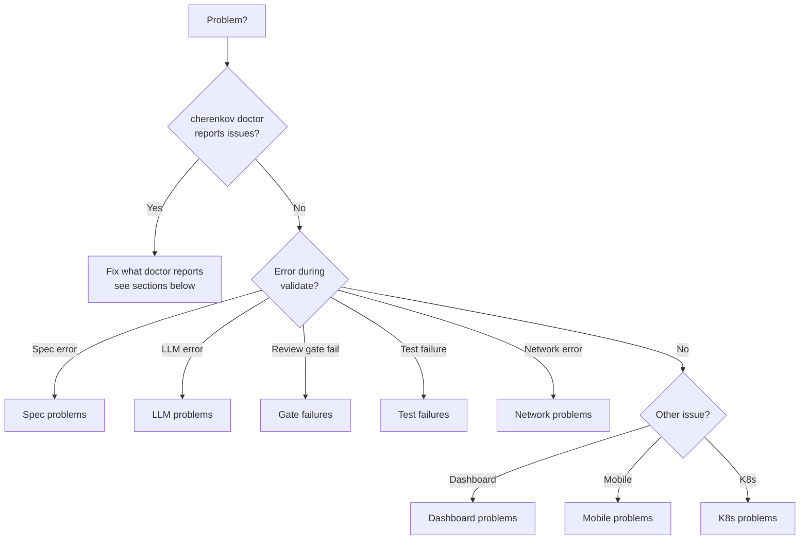

# Troubleshooting

> **Navigation:** [Home](Home.md) · [Pipeline](Pipeline.md) · [Architecture](Architecture.md) · [CLI Reference](CLI-Reference.md) · [Configuration](Configuration.md) · [Deployment](Deployment.md) · [Roadmap](Roadmap.md) · [FAQ](FAQ.md) · **Troubleshooting**

Diagnose and fix common problems.

**First step:** always run `./bin/cherenkov doctor` — it checks every dependency and tells you what's missing.

---

## Diagnostic Tree



---

## Installation Problems

### Python version too old

```
Error: Python 3.10+ required, found 3.9.x
```

```bash
# Check version
python3 --version

# Install 3.12 (Ubuntu/Debian)
sudo apt install python3.12 python3.12-venv

# macOS (Homebrew)
brew install python@3.12

# Use specific version for the venv
python3.12 -m venv .venv && source .venv/bin/activate
```

### pip install fails

```bash
# Upgrade pip first
pip install --upgrade pip

# If SSL errors on corporate network
pip install --trusted-host pypi.org --trusted-host files.pythonhosted.org -r requirements.txt
```

### Node modules missing

```
Error: Cannot find module '@playwright/test'
```

```bash
cd stub && npm install && npx playwright install && cd ..
```

### Playwright browsers not installed

```
Error: Executable doesn't exist at ...
```

```bash
cd stub && npx playwright install && cd ..
# If permission error:
npx playwright install --with-deps
```

---

## Ollama Problems

### Ollama not running

```
Error: connection refused http://localhost:11434
```

```bash
# Start Ollama
ollama serve

# Check it's running
curl http://localhost:11434/api/tags
```

### Model not pulled

```
Error: model 'qwen2.5-coder:7b' not found
```

```bash
ollama pull qwen2.5-coder:7b
ollama pull deepseek-r1:8b    # For planning stage

# Check pulled models
ollama list
```

### Ollama is slow (no GPU)

This is expected on CPU — ~10× slower than GPU. Each test takes ~15–20s instead of 3–5s.

```bash
# Check if Ollama is using GPU
ollama run qwen2.5-coder:7b
# Look for "using cuda" in the output

# If no GPU available, use a smaller model
export CHERENKOV_LLM_MODEL=qwen2.5-coder:3b
```

### Ollama OOM (out of memory)

```
Error: GGML_ASSERT: ggml_metal.m:xxx
```

The model doesn't fit in GPU VRAM. Switch to a smaller model:

```bash
# 8GB VRAM: use 7b
export CHERENKOV_LLM_MODEL=qwen2.5-coder:7b

# 4-6GB VRAM: use 3b
export CHERENKOV_LLM_MODEL=qwen2.5-coder:3b

# CPU only: use 3b
export CHERENKOV_LLM_MODEL=qwen2.5-coder:3b
```

---

## Spec Problems

### Spec not found

```
Error: Could not load OpenAPI spec from http://localhost:8000/openapi.json
```

```bash
# Option 1: Pass the spec file directly
./bin/cherenkov validate --target http://localhost:8000 --spec ./openapi.yaml

# Option 2: Check if the spec is served
curl http://localhost:8000/openapi.json
curl http://localhost:8000/openapi.yaml
# Try /docs, /swagger.json, /api-docs
```

### Spec validation error

```
Error: Invalid OpenAPI spec: missing required field 'info.title'
```

Validate your spec with [Spectral](https://stoplight.io/open-source/spectral) or [Swagger Editor](https://editor.swagger.io):

```bash
# Install Spectral
npm install -g @stoplight/spectral-cli

# Lint your spec
spectral lint ./openapi.yaml
```

### OpenAPI 2.x (Swagger) spec

CHERENKOV requires OpenAPI 3.x. Convert your spec:

```bash
# Install swagger2openapi
npm install -g swagger2openapi

# Convert
swagger2openapi swagger.json -o openapi.json
```

---

## LLM / Generation Problems

### Gate 5 failure — TypeScript compile error

```
Review gate 5 failed: TypeScript compile error
  error TS2345: Argument of type...
```

Usually a type mismatch in generated code. CHERENKOV retries up to 3 times automatically. If it keeps failing:

```bash
# Check that TypeScript is properly installed
cd stub && npx tsc --version

# Reinstall if needed
cd stub && npm install && cd ..

# Run with verbose to see the generated code
./bin/cherenkov validate --target http://localhost:8000 --verbose
```

### Gate 6 failure — Prism dry-run

```
Review gate 6 failed: Prism returned unexpected status
```

Prism is the OpenAPI mock server used for pre-flight test checks. Make sure it's running:

```bash
# Start Prism
docker run --rm -p 4010:4010 \
  stoplight/prism mock \
  http://host.docker.internal:8000/openapi.json

# Set the URL
export CHERENKOV_PRISM_URL=http://localhost:4010
```

If you don't have Docker, skip Gate 6:

```bash
# Gate 6 is optional — skip with:
export CHERENKOV_SKIP_PRISM=true
```

### LLM keeps generating wrong code (all retries fail)

```bash
# 1. Try a different model
export CHERENKOV_LLM_MODEL=qwen2.5-coder:14b

# 2. Check if the spec has unusual patterns
./bin/cherenkov explore --spec ./openapi.yaml

# 3. Run in verbose mode to see the prompts
./bin/cherenkov validate --verbose --target http://localhost:8000
```

---

## Test Failures

### Test fails — status mismatch

```
FAILED: password_too_short
  expected: 422 (from spec)
  actual:   400
```

This is a **conformance bug in your server**, not in CHERENKOV. Your OpenAPI spec says the server should return 422, but it returns 400.

Fix options:
1. Fix the server to return 422 for validation errors
2. Update the spec to say 400 instead of 422
3. Run `./bin/cherenkov heal` to get a more detailed suggestion

### All tests fail — "connection refused"

```
FAILED: all tests
  Error: connect ECONNREFUSED 127.0.0.1:8000
```

Your target API isn't running:

```bash
# Start your API first
cd target && uvicorn target_api:app --host 127.0.0.1 --port 8000 &

# Then validate
./bin/cherenkov validate --target http://localhost:8000
```

### Tests fail — auth errors (401/403)

Your API requires authentication. Set the auth token:

```bash
# Bearer token
export CHERENKOV_AUTH_TOKEN=your-token-here

# API key header
export CHERENKOV_API_KEY=your-key-here
export CHERENKOV_AUTH_SCHEME=ApiKey

./bin/cherenkov validate --target http://localhost:8000
```

---

## Dashboard Problems

### Dashboard won't open

```bash
# Check Node is installed
node --version  # needs 20+

# Install UI dependencies
cd cherenkov/web/ui && npm install && cd ../../..

# Retry
./bin/cherenkov review --web
```

### Dashboard shows no data

The dashboard reads from `.cherenkov/report.json`. Run `validate` first:

```bash
./bin/cherenkov validate --target http://localhost:8000
./bin/cherenkov review --web
```

---

## Docker Problems

### Port already in use

```
Error: port 4010 already in use
```

```bash
# Find what's using the port
lsof -i :4010

# Kill it or use a different port
export CHERENKOV_PRISM_URL=http://localhost:4011
docker run -p 4011:4010 stoplight/prism mock <spec-url>
```

### Docker Compose services not starting

```bash
# Check logs
docker compose logs

# Start specific service
docker compose up prism

# Reset everything
docker compose down && docker compose up -d
```

---

## K8s / Operator Problems

### `make k3d-up` fails

```bash
# Install k3d
curl -s https://raw.githubusercontent.com/k3d-io/k3d/main/install.sh | bash

# Check Docker is running
docker ps

# Retry
make k3d-up
```

### CRD not found

```
error: resource mapping not found for name "my-check" namespace "" from "": no matches for kind "ConformanceCheck" in version "qa.cherenkov.dev/v1alpha1"
```

```bash
# Apply CRD definitions
kubectl apply -f operator/config/crd/

# Check CRD is registered
kubectl get crds | grep cherenkov
```

---

## Mobile Testing Problems

### "ADB not found"

Mobile testing (Track D) requires Android Debug Bridge. Install Android platform tools:

```bash
# Ubuntu/Debian
sudo apt install android-sdk-platform-tools

# macOS
brew install android-platform-tools

# Verify
adb devices
```

### "No devices found"

```bash
# Start an emulator
# Android Studio → AVD Manager → Start device

# Or connect a physical device with USB debugging enabled
adb devices
```

---

## Getting More Help

If none of the above fixes your issue:

1. **Run `./bin/cherenkov doctor`** and include the output
2. **Run with `--verbose`** to get full debug output
3. **Check the report** at `.cherenkov/report.json` for detailed failure info
4. **Open a GitHub issue** with:
   - The exact command you ran
   - The full error output (not a summary)
   - Output of `./bin/cherenkov doctor`
   - Your OS, Python version, Node version

[Open an issue](https://github.com/moaidmoatasem/cherenkov-qa/issues/new/choose)
