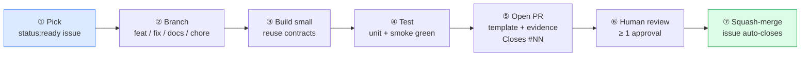

# Way of Work

> **Navigation:** [Home](Home.md) · [Pipeline](Pipeline.md) · [Architecture](Architecture.md) · [CLI Reference](CLI-Reference.md) · [Configuration](Configuration.md) · [Deployment](Deployment.md) · [Roadmap](Roadmap.md) · [FAQ](FAQ.md) · [Troubleshooting](Troubleshooting.md) · **Way of Work**

How to contribute — humans and AI agents follow the same rules.

> **Full reference:** [CONTRIBUTING.md](../../CONTRIBUTING.md)
> **Read first:** [docs/STATUS.md](../STATUS.md) · [docs/HANDOVER.md](../HANDOVER.md)

---

## The Golden Rule

**Show raw evidence. Never a summary.**

"Tests pass" is a claim. Pasted terminal output is evidence. PRs without evidence are not reviewable.

---

## The Loop



---

## Step by Step

### 1. Pick an issue

Find an open issue with `status:ready`. Agents also need `agent-ready`.

Filter options on the [issue board](https://github.com/moaidmoatasem/cherenkov-qa/issues):
- `type:task` — individual shippable units
- `type:bug` — confirmed bugs
- `type:feature` — new capabilities

**One issue = one branch = one PR.** Never bundle two concerns.

### 2. Create a branch

```bash
git checkout main && git pull
git checkout -b feat/123-short-description    # new feature
git checkout -b fix/456-what-is-broken        # bug fix
git checkout -b docs/789-what-doc             # documentation only
git checkout -b chore/101-what-task           # tooling / config
```

Never commit directly to `main`.

### 3. Build small

- Reuse `cherenkov/core/contracts.py` — never fork core models
- Add a versioned adapter/plugin at the seam — ADR-001 style
- If you're unsure of the scope, check [HANDOVER.md](../HANDOVER.md)

### 4. Test

```bash
PYTHONPATH=. python -m pytest tests/unit/ -v
PYTHONPATH=. python3 tests/smoke/smoke_test_healing.py
PYTHONPATH=. python3 tests/smoke/smoke_test_polish.py
PYTHONPATH=. python3 scripts/ci_docs_check.py
```

Add tests for every new behaviour. Tests must be green before opening the PR.

### 5. Open a PR

Fill every field of the PR template:

| Field | What to put |
|-------|------------|
| **What & why** | One sentence — what changed, why it matters |
| `Closes #NN` | Issue number — auto-closes it on merge |
| **Raw evidence** | Pasted terminal output — not a description |
| **Checklist** | Every box checked; unchecked items get a note |

### 6. Human review

Required checks that must be green on `main`:

| Check | What it tests |
|-------|--------------|
| Documentation Coverage | `scripts/ci_docs_check.py` — CLI flags in docs |
| Healing Suggest-Only | D7 invariant — healing never writes test files |
| CLI Help + Docs Gate | `smoke_test_polish.py` — help text matches docs |
| CodeQL | Security scan |

No self-merge. Resolve all threads. Re-request after addressing feedback.

### 7. Squash-merge

Squash only. Linear history. The issue auto-closes. The milestone burns down.

---

## Design Invariants

These are tested in CI. Breaking them fails required checks.

| Invariant | Rule |
|-----------|------|
| **D7 — no auto-edit** | Healing and validate never write to test files. Suggestions only. |
| **Anti-lock-in** | `eject` yields vanilla Playwright + `openapi-fetch`, zero CHERENKOV imports |
| **Suggest-only healing** | Healing never auto-commits or auto-applies |
| **Spec-derived oracle** | Expected HTTP status from the OpenAPI spec, never hardcoded |
| **Model-agnostic** | Emit `ReasoningRequest{capability_tier}` — never name a model in code |

---

## Hard Stops

- No direct commits to `main`
- No force-push on shared branches
- No history rewrite on shared branches
- No imports from `track-b-c-deferred/` (quarantined)
- No fabricated test results — raw evidence only
- No secrets in code or config files

---

## Commit Messages

[Conventional Commits](https://www.conventionalcommits.org/) format:

```
feat(substrate): add LocalAI tier-2 routing (#123)
fix(healing): stop writing test file on suggest-only path (#124)
docs(wiki): add deployment guide (#125)
chore(ci): pin playwright to 1.49.1 (#126)
test(smoke): assert eject has zero cherenkov imports (#127)
```

Imperative mood: `add`, `fix`, `update` — not `added`, `fixed`.

---

## For AI Agents

Extra rules on top of everything above:

1. Read [AGENTS.md](../../AGENTS.md) before starting
2. Read [HANDOVER.md](../HANDOVER.md) — it says what is real vs fabricated
3. Only pick `agent-ready` issues
4. Add a co-author trailer to your commit
5. Paste raw terminal output in the PR body

---

## Definition of Done

- [ ] Code written, reuses existing contracts
- [ ] Unit + smoke tests added and green (evidence pasted in PR)
- [ ] Docs updated if behaviour changed
- [ ] `ci_docs_check.py` passes
- [ ] All required CI checks green
- [ ] PR template fully filled
- [ ] ≥ 1 human approval
